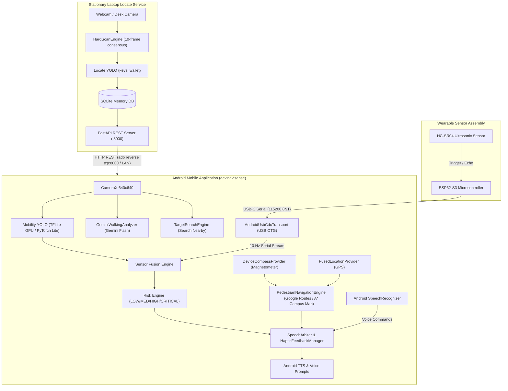

# NaviSense AI — Assistive Vision & Multimodal Navigation System

[-3DDC84?logo=android&logoColor=white)](android/)
[](laptop/)
[](esp32/)
[](models/)
[](LICENSE)

> **NaviSense AI** is a voice-first assistive navigation and spatial memory platform designed for visually impaired and low-vision individuals. It combines wearable real-time visual-ultrasonic obstacle avoidance on Android, pedestrian turn-by-turn routing with compass orientation, stationary tabletop spatial memory on a laptop, and multimodal scene narration powered by Google Gemini.

---

## 📖 Table of Contents

- [Overview & Key Features](#-overview--key-features)
- [System Architecture](#-system-architecture)
- [Hardware Setup & Wiring](#-hardware-setup--wiring)
- [Repository Structure](#-repository-structure)
- [Setup & Installation Guidelines](#-setup--installation-guidelines)
  - [Prerequisites](#prerequisites)
  - [1. ESP32-S3 Firmware Setup](#1-esp32-s3-firmware-setup)
  - [2. Laptop Memory & Locate Server](#2-laptop-memory--locate-server)
  - [3. Android Application Setup](#3-android-application-setup)
- [Operating Modes & Voice Commands](#-operating-modes--voice-commands)
- [AI Models & Sensor Fusion](#-ai-models--sensor-fusion)
- [Testing & Quality Verification](#-testing--quality-verification)
- [Team & Acknowledgments](#-team--acknowledgments)

---

## 🌟 Overview & Key Features

NaviSense separates indoor and outdoor assistive guidance into two specialized tiers:

1. **Mobile Perception & Walking Navigation (Android + ESP32 + HC-SR04)**:
   - **Real-Time Obstacle Avoidance**: Runs fine-tuned lightweight YOLO models accelerated via TFLite GPU and PyTorch Lite alongside an HC-SR04 ultrasonic rangefinder connected over USB-C OTG at 10 Hz.
   - **Multimodal Risk Engine**: 3-tier safety arbitration (LOW, MEDIUM, HIGH, CRITICAL). Immediate speech/haptic preemption ensures obstacle warnings override conversational speech instantly.
   - **Turn-by-Turn Pedestrian Navigation**: Integrated with Google Routes API for outdoor walking, plus an offline topological A* routing engine for campus walkways (e.g. VIT Chennai campus with 11 primary landmarks/POIs).
   - **Compass & Orientation Assistance**: Reads physical device magnetometer/accelerometer sensors to provide directional cues ("heading north", "turn 45 degrees left").
   - **Multimodal Visual Narration**: Integrates Google Gemini Flash (2.0/1.5) to capture and describe visual surroundings upon user command.
   - **Personal Item Search ("Search Nearby")**: Real-time stationary camera sweep using TFLite GPU acceleration to locate misplaced items (e.g., keys, wallet) with directional guidance.

2. **Stationary Spatial Memory & Hard Scan (Laptop Server)**:
   - **Tabletop Object Memory**: Continuously or on-demand monitors personal spaces (e.g., study desk, dining table) divided into semantic zones (`zone_left`, `zone_center`, `zone_right`).
   - **Transactional Hard Scan**: Captures 10 consecutive frames across 2 seconds, enforcing a multi-frame consensus gate ($\ge 6/10$ detections at $\ge 0.60$ confidence) before committing an observation to SQLite.
   - **FastAPI HTTP REST API**: Exposes endpoints for the Android client to query object locations ("Where are my keys?"), verify health, or trigger fresh scans.

---

## 📐 System Architecture



---

## 🔌 Hardware Setup & Wiring

The wearable sensor assembly provides physical distance detection up to 4 meters, complementing the computer vision pipeline even in low-light conditions or with transparent/unclassified obstacles.

### Bill of Materials
- **Microcontroller**: ESP32-S3 Dev Module (with Native USB CDC support)
- **Ranging Sensor**: HC-SR04 Ultrasonic Distance Sensor (or HC-SR04P 3.3V version)
- **Interconnect**: USB Type-C OTG cable or USB-C to USB-A adapter
- **Mounting**: 3D-printed chest mount, lanyard clip, or eyeglasses bracket
- **Voltage Divider Resistors**: 1kΩ and 2kΩ (required if using 5V HC-SR04 to protect the 3.3V ESP32 GPIO)

### Wiring Pinout Table

| HC-SR04 Pin | ESP32-S3 Pin | Function / Description |
|---|---|---|
| **VCC** | **5V / VBUS / VIN** | 5V DC power from USB host |
| **GND** | **GND** | Common ground |
| **TRIG** | **GPIO 4** | 10 µs trigger pulse output |
| **ECHO** | **GPIO 5** | Echo pulse input (*via 1kΩ / 2kΩ voltage divider if 5V*) |

> [!NOTE]
> If using a standard 5V HC-SR04, connect `ECHO` through a voltage divider: `ECHO -> 1kΩ resistor -> GPIO 5 -> 2kΩ resistor -> GND` to step down the 5V signal to 3.3V safe logic levels.

### Sensor Wire Protocol
The ESP32-S3 emits newline-delimited ASCII records at **10 Hz** (115200 baud, 8N1) over USB CDC:
```text
V=1,SEQ=<seq>,UP_MS=<uptime_ms>,DIST_CM=<distance_cm>,VALID=<0|1>
```
- `V=1`: Protocol version 1
- `SEQ`: 32-bit unsigned monotonic sequence counter
- `UP_MS`: Device uptime in milliseconds
- `DIST_CM`: Measured distance between `2` and `400` cm (`-1` on timeout or invalid echo)
- `VALID`: `1` when $2 \le \text{DIST\_CM} \le 400$; `0` otherwise

---

## 📁 Repository Structure

```text
NaviSense-AI/
├── android/                         # Android application (Kotlin, Gradle)
│   ├── app/
│   │   ├── src/main/java/dev/navisense/
│   │   │   ├── app/                 # MainActivity, NaviSenseApp, SessionCoordinator
│   │   │   ├── camera/              # CameraXAnalyzer, DetectionOverlayView, YuvConverter
│   │   │   ├── cloud/               # GeminiFlashClient, GeminiWalkingAnalyzer
│   │   │   ├── contracts/           # Perception, Risk, Sensor & Navigation data models
│   │   │   ├── inference/           # TfliteGpuLocateBackend, PyTorchLiteBackend, ModelRunner
│   │   │   ├── map/                 # CampusDestinationResolver, MapRoutingEngine (A*)
│   │   │   ├── navigation/          # RiskEngine, WalkingCorridor, SensorFusion
│   │   │   │   └── maps/            # PedestrianNavigationEngine, GoogleRoutesService, Compass
│   │   │   ├── networking/          # MemoryClient (HTTP OkHttp client for laptop memory)
│   │   │   ├── search/              # TargetSearchEngine (Search Nearby)
│   │   │   ├── usb/                 # AndroidUsbCdcTransport, SensorParser, UsbSensorAdapter
│   │   │   └── voice/               # SpeechArbiter, VoiceCommandManager, TTS Player
│   │   └── src/main/assets/
│   │       ├── maps/                # Offline topological map (vit_chennai_map.json)
│   │       └── models/              # locate_model.tflite, locate_obstacle_model.tflite
│   └── build.gradle.kts
├── laptop/                          # Stationary Locate backend (Python, FastAPI, SQLite)
│   ├── api/                         # FastAPI server, endpoints, Pydantic schemas
│   ├── config/                      # Tabletop spatial zones (Left, Center, Right), settings
│   ├── storage/                     # SQLite persistence layer (DatabaseManager, transactions)
│   ├── scanner.py                   # 10-frame Hard Scan transactional engine
│   ├── run_server.py                # Server launch entrypoint
│   ├── requirements-dev.txt         # Python dependencies
│   └── tests/                       # Pytest test suite (API, scanner, storage, schemas)
├── esp32/                           # Microcontroller firmware
│   └── navisense_sensor/
│       └── navisense_sensor.ino     # Arduino C++ sketch for ESP32-S3 + HC-SR04 (10 Hz)
├── models/                          # Machine learning contracts and models
│   ├── metadata/                    # Model input/output contracts (locate & mobility)
│   └── checkpoints/                 # Fine-tuned weights and export artifacts
└── scripts/                         # Python utility and verification scripts
    ├── test_sensor_serial.py        # Microcontroller serial protocol verification tool
    ├── train_locate.py              # Locate YOLO fine-tuning pipeline
    ├── train_mobility.py            # Mobility YOLO fine-tuning pipeline
    └── export_locate_model.py       # TFLite and PyTorch Mobile export pipeline
```

---

## 🚀 Setup & Installation Guidelines

### Prerequisites

| Tool / Dependency | Version | Purpose |
|---|---|---|
| **Android Studio** | Hedgehog (2023.1.1) or newer | Android development & building |
| **JDK** | Java 17 | Kotlin / Gradle compilation |
| **Android SDK** | Compile SDK 34, Min SDK 26 | Android API target |
| **Python** | 3.10 to 3.14 | Laptop server, training & tooling |
| **Arduino IDE** | 2.0+ (or PlatformIO / Arduino CLI) | Flashing ESP32-S3 firmware |
| **ESP32 Board Package** | `esp32` by Espressif $\ge 2.0.11$ | Microcontroller board definitions |

---

### 1. ESP32-S3 Firmware Setup

1. **Install ESP32 Board Definitions**:
   - Open **Arduino IDE** $\rightarrow$ **Settings / Preferences**.
   - In *Additional Board Manager URLs*, add:
     ```text
     https://raw.githubusercontent.com/espressif/arduino-esp32/gh-pages/package_esp32_index.json
     ```
   - Go to **Tools $\rightarrow$ Board $\rightarrow$ Boards Manager**, search for `esp32`, and install.

2. **Open & Configure the Sketch**:
   - Open `esp32/navisense_sensor/navisense_sensor.ino`.
   - Under the **Tools** menu, select:
     - **Board**: `ESP32S3 Dev Module` (or your specific ESP32-S3 variant)
     - **USB CDC On Boot**: `Enabled` *(Crucial for direct USB serial communication)*
     - **Upload Mode**: `USB-OTG CDC (TinyUSB)`
     - **Port**: Select the COM port assigned to your ESP32-S3.

3. **Compile & Flash**:
   - Click **Upload**.
   - Once flashed, verify data output in Serial Monitor at `115200 baud`.

4. **Verify Protocol with Python Tool**:
   From the repository root:
   ```bash
   # Test against simulated synthetic edge cases:
   python scripts/test_sensor_serial.py --self-test

   # Test real device over serial:
   python scripts/test_sensor_serial.py --port COM3 --baud 115200 --duration 10

   # Or run a software mock (no hardware needed):
   python scripts/test_sensor_serial.py --mock --duration 5
   ```

---

### 2. Laptop Memory & Locate Server

1. **Set Up Python Environment**:
   ```powershell
   # From the repository root
   python -m venv .venv
   .\.venv\Scripts\activate
   pip install -r laptop/requirements-dev.txt
   ```

2. **Run Pytest Suite**:
   ```powershell
   # Use custom basetemp to avoid Windows temp folder permission issues
   pytest laptop/tests --basetemp=.pytest_temp
   ```
   *Expected result: 43 passed.*

3. **Start the FastAPI Server**:
   ```powershell
   python laptop/run_server.py --host 0.0.0.0 --port 8000
   ```
   Endpoints available:
   - `GET  /api/v1/health` — Service status and stationary camera check
   - `GET  /api/v1/objects/locate?name=keys` — Query last observed location
   - `POST /api/v1/scan` — Trigger an immediate 10-frame Hard Scan
   - `POST /api/v1/memory/clear` — Clear memory history

4. **Bridge Phone to Laptop via USB (Optional / Recommended)**:
   If your Android phone is connected to your laptop via USB with USB debugging enabled, route HTTP traffic over ADB:
   ```powershell
   adb reverse tcp:8000 tcp:8000
   ```
   Now the Android app can query `http://127.0.0.1:8000` seamlessly without configuring local Wi-Fi IP addresses.

---

### 3. Android Application Setup

1. **Configure Local Properties & API Keys**:
   Create or edit `android/local.properties`:
   ```properties
   sdk.dir=C\:\\Users\\<YourUsername>\\AppData\\Local\\Android\\sdk
   
   # Optional: Google Maps Directions API key for outdoor pedestrian routes
   GOOGLE_MAPS_API_KEY=YOUR_GOOGLE_MAPS_API_KEY_HERE
   ```

2. **Run Unit Tests**:
   ```powershell
   cd android
   .\gradlew testDebugUnitTest
   ```
   *Expected result: 158 passed (covering campus maps, routing, speech arbiter, risk engine, USB parser).*

3. **Build & Install the Debug APK**:
   ```powershell
   .\gradlew assembleDebug
   adb install -r app\build\outputs\apk\debug\app-debug.apk
   ```

4. **Connect ESP32-S3 via USB OTG**:
   - Connect the flashed ESP32-S3 sensor module to the Android phone using a USB-C OTG cable.
   - Accept the Android USB permission dialog when prompted.
   - The app's top bar will display `SENSOR: CONNECTED (10 Hz)` with live distance readings.

---

## 🗣️ Operating Modes & Voice Commands

The application provides an accessible, high-contrast user interface with large touch targets ($\ge 48\text{ dp}$), full TalkBack integration, and comprehensive voice control.

### Voice Commands

| Voice Trigger Phrase | Action / Subsystem |
|---|---|
| **"Start navigation"** / **"Start walking"** | Activates Standalone Walking Assistance (Mobility YOLO + Ultrasonic Sensor) |
| **"Where are my keys?"** / **"Where is my wallet?"** | Queries Laptop Memory; returns last observed tabletop zone |
| **"Search nearby"** | Launches on-device camera sweep using TFLite GPU Locate YOLO |
| **"Stop"** / **"Cancel"** | Instantly ceases guidance, audio, and active navigation |
| **"Take me to library"** | Triggers turn-by-turn pedestrian routing to Central Library |
| **"Navigate to Academic Block 1"** (AB1) | Routes to Netaji Auditorium / AB1 via campus walkway network |
| **"Directions to Food Court"** | Routes to Ambrosia cafeteria / gazebo via campus paths |
| **"Describe surroundings"** | Triggers Gemini Flash visual narration of current camera frame |

---

## 🧠 AI Models & Sensor Fusion

### 1. Mobility YOLO (Walking Hazards)
- **Classes**: `person`, `chair`, `table`, `backpack`, `bottle`
- **Inference Runtime**: PyTorch Mobile Lite (`mobility_smoke.ptl`) / TFLite
- **Target Performance**: $\ge 10\text{ FPS}$ on mid-range Android devices, latency $< 150\text{ ms}$

### 2. Locate YOLO & Obstacle YOLO (Object Memory & Search)
- **Classes**: `keys`, `wallet` (plus extended indoor obstacles: `chair`, `table`, `couch`, `door`)
- **Inference Runtime**: TFLite GPU-accelerated (`locate_model.tflite`, `locate_obstacle_model.tflite`)
- **Tabletop Zones**: Normalized bounding box coordinates map objects to `Left Table`, `Center Table`, or `Right Table`.

### 3. Risk Fusion & Arbitration Policy
- **CRITICAL / HIGH Risk**: Obstacle detected in center corridor $\le 1.0\text{ m}$ (visual or ultrasonic) $\rightarrow$ Immediate speech alert and heavy haptic vibration.
- **MEDIUM Risk**: Obstacle at $1.0 - 2.0\text{ m}$ $\rightarrow$ Warning alert.
- **Preemption Rule**: Emergency safety alerts preempt any ongoing turn-by-turn guidance or conversation.

---

## 🧪 Testing & Quality Verification

Run the complete test suite across all subsystems:

```powershell
# 1. Hardware & Serial Protocol Self-Test
python scripts/test_sensor_serial.py --self-test

# 2. Laptop Memory & Scanner Test Suite (43 tests)
pytest laptop/tests --basetemp=.pytest_temp

# 3. Android Subsystem Unit Tests (158 tests)
cd android
.\gradlew testDebugUnitTest
```

---

## 👥 Team & Acknowledgments

**Team SHELBY — VMedithon 3.0 (VIT Chennai)**
- **Samik** — Android CameraX, Model Inference (TFLite GPU / PyTorch Lite), Visual Tracking & Search Nearby
- **Rishav** — Risk Logic, Voice UX, Accessible UI Shell, Speech Arbiter & Lifecycle Integration
- **Rohan** — ESP32-S3 Hardware, Mount Design, HC-SR04 Firmware & Android USB CDC Adapter
- **Subham** — Laptop Stationary Locate Service, SQLite Spatial Memory & REST API
- **Spandan** — Dataset Preparation, Model Training, Fine-Tuning & Model Quantization / Export

---

## 📄 License

This project is licensed under the MIT License — see the [LICENSE](LICENSE) file for details.
