# NaviSense AI — Product Requirements Document

**Project:** NaviSense AI  
**Team:** SHELBY  
**Hackathon:** VMedithon 3.0  
**Track:** Open Innovation  
**Institution:** VIT Chennai  
**Product Category:** Assistive AI / Voice-Guided Navigation  
**Document Version:** 3.2  
**Status:** Hackathon MVP

**Canonical README and frozen product contract:** This existing file is the project's README; do not create a competing README or rename it during ordinary continuation. Together with main guidance, it is frozen under [AGENTS](../AGENTS.md). Record implementation progress in [implementation state](implementation-state.md) and follow the [24-hour implementation plan](implementation-plan.md). Technical requirements and acceptance criteria remain PRD v3.2.

**Revision 3.2:** Hardens lifecycle/cancellation, sensor freshness, risk release, speech arbitration, memory transactions, API validation, and acceptance evidence. Preserves standalone walking and mandatory Android Locate. Requirements and thresholds are specified, not yet implemented or experimentally accepted.

**Requirement authority:** Must/shall requirements define the baseline. Should/Could features are excluded from baseline acceptance unless explicitly implemented and evaluated. Section 11 owns memory semantics, Sections 13–14 own integration/lifecycle contracts, Section 17 owns risk rules, Section 18 owns speech arbitration, and Section 29 owns acceptance. Examples and diagrams illustrate these contracts and cannot override them. Threshold changes must be versioned and retested; an observed failure is not permission to silently weaken a gate.

> **Product principle:** NaviSense separates indoor assistance into two specialized perception systems:  
> **(1) a stationary laptop-based Locate system that remembers where objects were last seen**, and  
> **(2) a mobile Android system that independently provides walking obstacle guidance using camera and ultrasonic sensing, and runs Locate YOLO for nearby/final object search.**

---

## 1. Executive Summary

NaviSense AI is a multimodal assistive system designed to help visually impaired and low-vision users:

1. understand nearby surroundings,
2. locate frequently used objects,
3. move through indoor spaces with obstacle warnings,
4. receive concise spoken guidance,
5. maintain a lightweight memory of where objects were last observed.

The hackathon MVP intentionally uses **two different YOLO models** because stationary object search and mobile obstacle avoidance have different requirements.

- **Locate YOLO** runs on the laptop for spatial memory and, as a mandatory mobile export, on Android for local personal-object search.
- **Mobility YOLO** runs on the Android phone and is optimized for fast recognition of obstacles such as people, chairs, tables, bags, and other walking hazards.

The phone also receives physical distance readings from an **HC-SR04 ultrasonic sensor connected to an ESP32-S3 through USB-C**. The Android app performs all mobile sensor fusion locally.

**Two primary experiences are required:** (1) standalone indoor walking assistance with no laptop, memory query, destination, or internet connection; and (2) memory-assisted object finding followed by Android final search. Standalone walking uses the phone plus its USB sensor assembly; phone-only vision is a degraded mode. Obstacles do not need a recognized class to trigger a distance warning. This does not imply detection of every physical object.

### Core Architecture

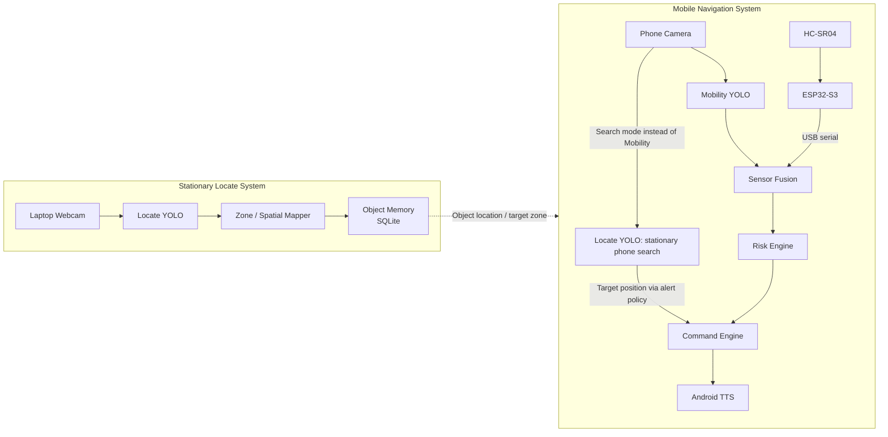

---

## 2. Product Vision

> **NaviSense AI is a voice-first indoor assistance platform that remembers where important objects were last seen and helps users move toward them safely using real-time visual and ultrasonic sensing.**

The user should not need to understand which model or device is active.

Example interactions:

- “Where are my keys?”
- “Start navigation.”
- “Search nearby for keys.”
- “Guide me there.”
- “What is ahead?”
- “Read this.”
- “Stop.”
- “What is around me?”

---

## 3. Problem Statement

Visually impaired and low-vision users can face difficulty with:

- identifying obstacles while walking,
- locating small personal items,
- understanding indoor surroundings,
- reading nearby text,
- remembering where belongings were placed,
- navigating unfamiliar or cluttered indoor spaces.

Conventional object detection alone is not sufficient.

A useful assistive system must answer four different questions:

1. **What is this?**
2. **Where was it last seen?**
3. **Is something in my walking path?**
4. **What should I do right now?**

NaviSense assigns each question to the subsystem best suited to answer it.

---

## 4. Product Goals

### 4.1 Primary Goals

- Detect and remember personal objects using a stationary laptop camera.
- Detect common walking obstacles using the phone camera.
- Start standalone walking assistance directly and report whether the observed forward corridor is clear, blocked, or unknown, regardless of object identity.
- Measure forward obstacle distance using HC-SR04.
- Fuse camera detections and ultrasonic distance readings.
- Produce short navigation commands such as:
  - “Chair ahead.”
  - “Cannot confirm the path is clear.”
  - “Slow down.”
  - “Stop.”
- Allow a user to ask where an object was last seen.
- Switch the phone from mobility mode to final object-search mode near the destination.
- Run Locate YOLO locally on Android for final search and direct nearby-object search.
- Maintain short-lived tracks and throttle duplicate alerts.

### 4.2 Secondary Goals

- OCR for reading visible text.
- Scene summarization.
- Voice command input.
- Room/zone graph routing.
- Directional escape guidance, only with separately tested side-clearance evidence.

### 4.3 Non-Goals for the Hackathon MVP

The MVP will **not** attempt to provide:

- medically certified navigation,
- centimetre-perfect object depth from the camera,
- autonomous outdoor navigation,
- full SLAM,
- multi-floor localization,
- map-grade indoor positioning,
- complete obstacle coverage at all heights,
- production safety guarantees.

---

## 5. Target Users

### Primary Users

Visually impaired or low-vision users who need assistance with:

- locating belongings,
- recognizing obstacles,
- receiving spoken indoor guidance.

### Secondary Users

Family members, caregivers, or administrators who may:

- calibrate room/zone layouts,
- configure stationary cameras,
- label zones,
- choose tracked objects.

---

# 6. System Architecture

NaviSense is divided into two independent but cooperating subsystems.

## 6.1 Stationary Locate System

The laptop stays at a fixed viewpoint.

Its job is:

> **Observe → detect → assign object to a spatial zone → remember last confident sighting.**

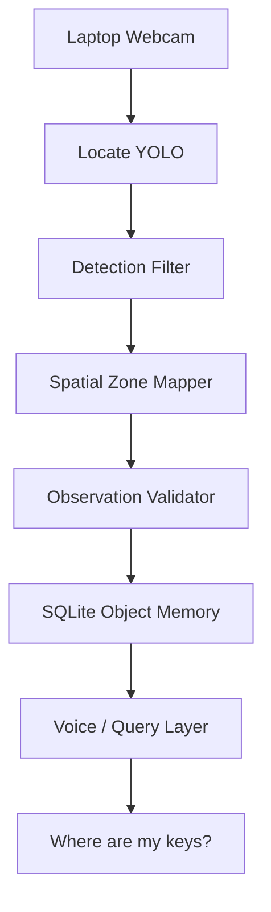

The laptop does **not** need to perform real-time walking safety.

---

## 6.2 Mobile Navigation System

The phone is carried by the user and runs the complete mobile navigation loop.

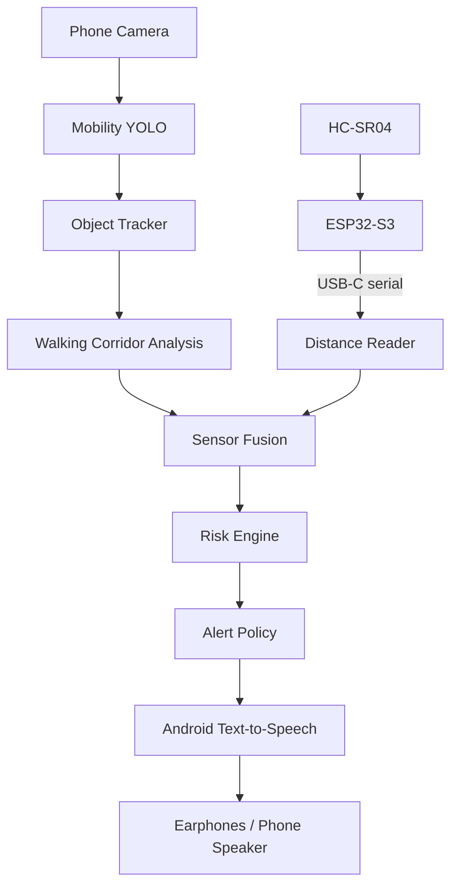

The mobile system does not require the laptop to start or continue standalone walking or nearby-object search. The laptop is required only for stationary scanning and retrieving its object memory.

### Standalone Walking Experience

“Start navigation” or the accessible Start button requests Mobility without a target. Start completes only after the readiness checks in Section 13.5; path state initially remains UNKNOWN. The phone continuously evaluates the forward corridor. A generic obstacle warning is sufficient; identifying the object is secondary. On “What is ahead?” or the path-status button, report one of:

- **BLOCKED:** “Obstacle ahead,” “Slow down,” or “STOP,” according to Section 17.
- **CLEAR_OBSERVED:** “No obstacle detected ahead.” This describes the currently observed corridor only, not guaranteed safe passage.
- **UNKNOWN:** “Cannot confirm the path is clear.” Missing or invalid evidence is never treated as clear.

Announce hazards automatically. Announce a transition from BLOCKED to CLEAR_OBSERVED once after the clearance hold in Section 17; do not repeatedly announce clear status. UNKNOWN entry produces one warning, repeated no more than once every 10 seconds while active.

---

# 7. Hardware Requirements

## 7.1 Required Hardware

| Hardware | Role | Required |
|---|---|---:|
| Laptop with webcam | Stationary object scanning, training, memory service | For Locate memory; not standalone walking |
| Android phone with rear camera | Mobile AI, sensor fusion, TTS, navigation | Yes |
| ESP32-S3 development board with USB | USB sensor controller | Yes |
| HC-SR04 ultrasonic sensor | Forward distance sensing | Yes |
| USB-C cable | Phone ↔ ESP32-S3 power/data | Yes |
| 1 kΩ resistor | HC-SR04 ECHO divider | Yes |
| 2 kΩ resistor | HC-SR04 ECHO divider | Yes |
| Jumper wires | Sensor wiring | Yes |
| Breadboard / small prototype board | Initial assembly | Recommended |
| Earphones/headphones | Private spoken guidance | Recommended |
| Fixed phone/sensor mount | Repeatable camera/sensor orientation | Required for walking acceptance; handheld allowed only for stationary search |
| Laptop charger | Power | Yes |
| Phone charger / power bank | Backup power | Recommended |

---

## 7.2 Mobile Hardware Topology

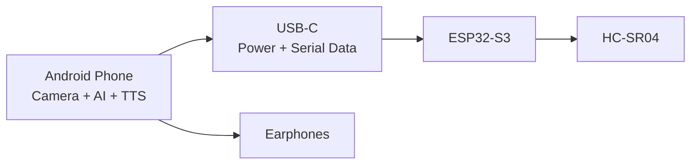

---

## 7.3 HC-SR04 Wiring

The HC-SR04 ECHO output is approximately 5 V and must **not** be connected directly to a 3.3 V ESP32-S3 GPIO.

### Recommended Voltage Divider

```text
HC-SR04 ECHO
      |
     1 kΩ
      |
      +-------> ESP32-S3 GPIO input
      |
     2 kΩ
      |
     GND
```

Approximate divided voltage:

```text
Vout = 5 × 2 / (1 + 2)
     ≈ 3.33 V
```

### Wiring Table

| HC-SR04 | Connection |
|---|---|
| VCC | 5 V |
| GND | GND |
| TRIG | ESP32-S3 GPIO output |
| ECHO | ESP32-S3 GPIO input through resistor divider |

Before assembly acceptance, record the exact phone, ESP32-S3 board revision, USB connector/serial interface, selected GPIOs, sensor supply source, and mount orientation. Verify USB host power/data and the ECHO input voltage against the selected hardware specifications and measured assembly. The nominal divider calculation is not a board-level electrical qualification. Do not infer pin assignments or power routing from the generic board name. These are configuration prerequisites, not a new hardware feature.

---

# 8. Two-Model AI Strategy

## 8.1 Model A — NaviSense Locate YOLO

### Purpose

Detect objects that users are likely to search for.

Potential custom classes:

- keys
- wallet
- glasses
- medicine box
- ID card
- phone
- bottle
- backpack
- earphones
- remote
- book

### Optimization Priority

```text
small-object accuracy > maximum FPS
```

### Typical Input

Stationary laptop room/table images and Android close-range, slow-scan images. Both viewpoints must be represented in Locate training and held-out evaluation. Use the same selected class vocabulary on both devices; a mobile export is mandatory, not a third model family.

### Typical Output

```json
{
  "class": "keys",
  "confidence": 0.93,
  "bbox": [411, 205, 482, 270],
  "camera_id": "laptop_cam",
  "zone": "table_right"
}
```

---

## 8.2 Model B — NaviSense Mobility YOLO

### Purpose

Recognize walking hazards quickly.

Desired obstacle categories include the following. Verify the selected weights' actual label map; broader terms such as boxes and furniture must not be assumed to be pretrained classes:

- person
- chair
- table
- backpack
- bottle
- bench
- suitcase
- bicycle
- large boxes
- furniture

### Optimization Priority

```text
low latency + high recall > fine-grained classification
```

The model should avoid missing large obstacles even if occasional false positives occur.

No class allowlist may gate ultrasonic risk. An unlabeled reflecting obstacle triggers the same proximity rules as a named one. The MVP does not add an open-world vision model or claim that YOLO detects arbitrary unseen classes.

---

## 8.3 Model Comparison

| Requirement | Locate YOLO | Mobility YOLO |
|---|---:|---:|
| Small-object accuracy | Very high | Medium |
| Inference speed | Medium | Very high |
| Stable camera assumption | Fixed laptop; slow phone scan | No |
| Motion blur tolerance | Low/medium | High |
| Personal-object classes | Important | Optional |
| Furniture classes | Useful | Critical |
| Tracking | Short-lived matching required for scan/search confirmation | Required for vision risk |
| Distance fusion | No | Yes |
| Runs on | Laptop and Android (mandatory) | Android phone |

---

# 9. Training Strategy

## 9.1 Mobility Model

The team should **not train basic chair/table/person recognition from scratch**.

Start from pretrained YOLO weights.

Fine-tune only if testing reveals poor performance under:

- motion blur,
- low-light hall conditions,
- unusual viewing angles,
- heavy occlusion,
- chest-mounted camera perspective.

### Mobility Pipeline

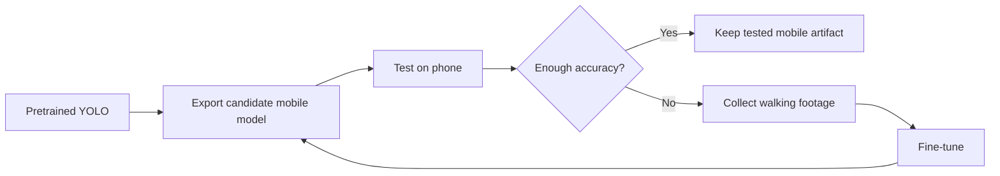

Before collecting the full dataset, select the demo Locate classes and one Android inference runtime through a small on-device smoke check. Record each model's hash, class order, input shape/type, color order, normalization/quantization, resize/letterbox transform, output decoding, and NMS settings in existing configuration. Laptop and Android Locate share canonical class names; do not assume their numeric class IDs or export outputs match without verification. A missing/incompatible model fails the relevant mode clearly; do not silently substitute a different detector. Choose the final runtime from measured phone results, not an untested performance assumption.

---

## 9.2 Locate Model

This is where most custom dataset effort should go.

The team can generate a useful dataset even with only one physical table by varying:

- object placement,
- orientation,
- distance,
- camera angle,
- lighting,
- background,
- occlusion,
- clutter,
- combinations of multiple objects.

### Example Dataset Variations

```text
same keys:
- centre of table
- left edge
- right edge
- partially under notebook
- beside bottle
- beside laptop
- bright light
- dim light
- rotated 90°
- far from camera
- close to camera
```

One physical table can therefore produce many visually different samples.

---

## 9.3 Dataset Split

Suggested starting split:

| Split | Percentage |
|---|---:|
| Training | 70% |
| Validation | 20% |
| Test | 10% |

The exact number of images depends on model performance.

Split by capture session/layout, not adjacent frames from the same video. Keep the held-out scenes separate from threshold tuning. Include phone search viewpoints as well as laptop images.

The hackathon objective is not to prove a universal detector. It is to prove the system architecture reliably on the selected object set.

---

# 10. Stationary Hard Scan

## 10.1 Definition

A **Hard Scan** is a stationary observation session in which the laptop:

1. captures room/table frames,
2. runs Locate YOLO,
3. accumulates detections across multiple frames,
4. rejects unstable low-confidence detections,
5. assigns accepted objects to named spatial zones,
6. updates object memory.

---

## 10.2 Hard Scan Flow

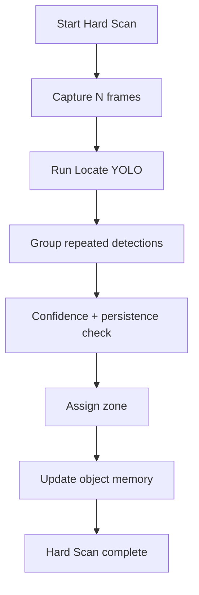

---

## 10.3 Spatial Zones

A stationary camera should not claim exact 3D coordinates unless proper depth/calibration exists.

For the hackathon, use coarse semantic zones.

Example:

```text
+--------------------------------------------------+
|                   CAMERA VIEW                    |
|                                                  |
| TABLE LEFT       TABLE CENTER       TABLE RIGHT  |
|                                                  |
| FLOOR LEFT       FLOOR CENTER       FLOOR RIGHT  |
|                                                  |
+--------------------------------------------------+
```

Example stored result:

```json
{
  "object_name": "keys",
  "area": "hackathon_hall",
  "zone": "team_table_right",
  "relative_x": 0.74,
  "relative_y": 0.59,
  "confidence": 0.92,
  "last_seen": "2026-09-14T10:31:42.000Z"
}
```

---

# 11. Object Memory

## 11.1 SQLite Schema

Use one observations table and a small local camera/zone configuration. Each completed Hard Scan appends a snapshot; no cross-camera identity tracking or normalized database framework is required.

```sql
CREATE TABLE observations (
    id INTEGER PRIMARY KEY AUTOINCREMENT,
    scan_id TEXT NOT NULL,
    object_name TEXT NOT NULL,
    camera_id TEXT NOT NULL,
    camera_profile_version INTEGER NOT NULL CHECK(camera_profile_version >= 1),
    area TEXT NOT NULL,
    zone TEXT NOT NULL,
    instance_in_scan INTEGER NOT NULL CHECK(instance_in_scan >= 1),
    relative_x REAL NOT NULL CHECK(relative_x BETWEEN 0 AND 1),
    relative_y REAL NOT NULL CHECK(relative_y BETWEEN 0 AND 1),
    confidence REAL NOT NULL CHECK(confidence BETWEEN 0 AND 1),
    seen_frames INTEGER NOT NULL CHECK(seen_frames BETWEEN 6 AND sampled_frames),
    sampled_frames INTEGER NOT NULL CHECK(sampled_frames = 10),
    first_seen TEXT NOT NULL,
    last_seen TEXT NOT NULL CHECK(first_seen <= last_seen),
    UNIQUE(scan_id, object_name, instance_in_scan)
);
```

All stored/API times use fixed millisecond precision UTC ISO-8601 strings ending in Z (for example, 2026-09-14T10:31:42.000Z). Validate timestamp syntax in the application before storage. first_seen and last_seen are actual accepted-match frame times within that scan, never query times. camera_profile_version identifies the configured fixed viewpoint; increment it when the camera moves or zones change. A local Clear history action deletes observations; Android can discover that deletion on its next successful lookup, not immediately while disconnected. Clear history does not delete models or calibration.

## 11.2 Observation Acceptance

- A Hard Scan samples 10 distinct frames at scheduled offsets 0, 200, ..., 1800 ms within a 2-second capture window. Never duplicate a frame to fill a slot. If capture fails or fewer than 10 frames are obtained, report scan failure and write nothing. Finish inference and commit within 5 seconds of scan start or fail without writing.
- Match same-class detections across frames using bounding-box IoU >= 0.30 and one-to-one matching. Keep distinct same-class objects separate within the scan.
- Accept an instance only if confidence >= 0.60 in at least 6 of 10 frames, with its box center in the same configured zone in those frames. Store mean accepted confidence and mean normalized box center; seen_frames counts those accepted matches.
- Zones must not overlap; a center outside a configured zone is not stored. Save all accepted instances in one transaction. An empty successful scan is reported as such and does not erase older observations.
- Only enabled cameras with a valid current calibration may create trusted observations. The operator must mark a moved camera invalid until recalibrated; automatic movement detection is outside the MVP. Earlier-profile rows remain historical, but cannot supply a usable target.

Allow one Hard Scan at a time. Allocate a unique scan_id at start and pin the camera profile version for the entire scan. Profile changes, cancellation, capture/inference failure, or Clear history invalidate that scan before commit. Serialize Clear history with commits: cancel/invalidate any in-flight scan, delete rows transactionally, then report success. Late scan callbacks must not repopulate cleared history. SQL/storage failure reports failure and preserves the previous committed observations; never announce a successful scan or clear before commit.

## 11.3 Query, Freshness, and Ambiguity

Use deterministic filtering and sorting, not an additional weighted score:

1. Normalize the requested name through a fixed alias map to the shared Locate class name. Unsupported names return unsupported.
2. Exclude disabled/invalid camera profiles and earlier profile versions from usable results. If only such history exists, return historical_only without a navigable target.
3. For each camera with that class, choose its latest accepted scan containing that class by maximum last_seen across that scan's matching rows, breaking ties by maximum row id; return all matching instances from that one scan. Do not mix rows from multiple scans or merge identical classes into a presumed personal identity. An older instance absent from that snapshot stays historical and is not proof of removal.
4. Sort candidates by last_seen descending, then confidence descending, then id descending. A single candidate may be offered; multiple candidates return ambiguous and require explicit selection. The MVP does not establish ownership from “my keys.”
5. age_seconds is the non-negative integer ceiling of (server_time - last_seen) in seconds. Age <= 60 seconds is recent; age > 60 seconds is stale. Exclude future-dated candidates; if none remain usable, return historical_only. Detect wall-clock jumps during a laptop process by comparing wall-clock and monotonic elapsed time; a discrepancy > 2 seconds invalidates active scans and marks memory untrusted until the operator checks the clock and recalibrates/rescans. Clock correctness across laptop restarts remains a setup prerequisite, not a claimed automatic capability.
6. Always say “last seen,” even for recent memory. Include age in stale results and require explicit confirmation before selecting a stale target.
7. No accepted observation means not_found. A missed detection or empty later scan does not prove removal. Do not refresh last_seen, set “present,” or claim an object is still there merely because a row exists.
8. A phone target is an in-memory selection, not a second history database. Clear it on cancel, completion, app restart, or explicit new selection. Store no phone raw frames or search detections in laptop memory in the MVP.

Example: “Keys were last seen on the right side of the team table 18 minutes ago.” If several instances exist: “I have multiple last-seen locations for keys. Choose a location.”

---

# 12. Hackathon Hall Model

The event hall may contain many chairs and tables even if the team owns only one table.

This does **not** require retraining every time.

The hall is treated as a set of named zones.

Example:

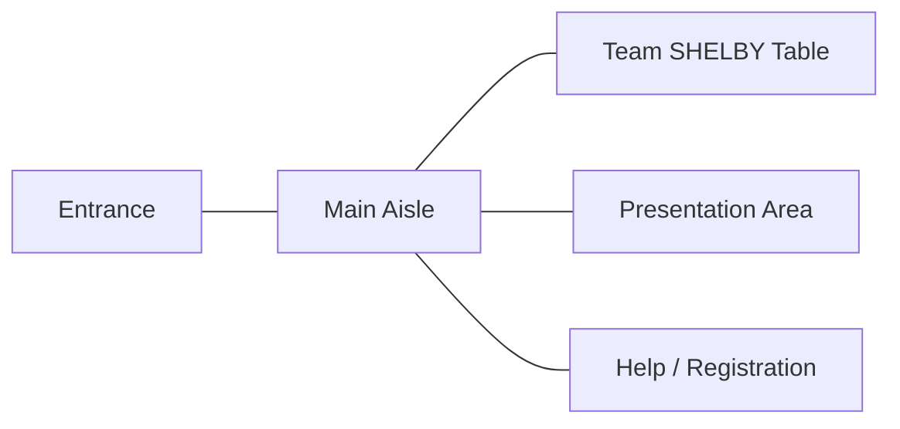

The stationary laptop can be associated with:

```text
Area: Hackathon Hall
Zone: Team SHELBY Table
Camera: laptop_cam
```

The mobile model handles obstacles dynamically while the user moves between zones.

---

# 13. Android Application

## 13.1 Recommended Modules

```text
NaviSense Mobile App
|
+-- Camera Module
|   +-- CameraX
|   +-- frame pre-processing
|
+-- AI Module
|   +-- Mobility YOLO
|   +-- Locate YOLO (mandatory Android export)
|   +-- object tracker
|
+-- USB Sensor Module
|   +-- ESP32-S3 detection
|   +-- serial parser
|   +-- sensor health monitor
|
+-- Navigation Module
|   +-- path corridor
|   +-- sensor fusion
|   +-- risk engine
|   +-- alert policy
|
+-- Voice Module
|   +-- Android TTS
|   +-- speech recognition
|
+-- Object Search Module
|   +-- target-object mode
|
+-- Connectivity Module
    +-- retrieve object memory / target zone
```

---

## 13.2 App Modes

```mermaid
stateDiagram-v2
    [*] --> Idle

    Idle --> Mobility : Start standalone walking, no target needed
    Idle --> FinalSearch : Search nearby, target selected
    Idle --> Find : "Find my keys"
    Idle --> Scene : "What's around me?"

    Find --> TargetKnown : Candidate selected, stale result confirmed if needed
    TargetKnown --> Mobility : "Guide me there"

    Mobility --> CriticalAlert : Critical obstacle
    CriticalAlert --> Mobility : Risk de-escalates after hold

    Mobility --> FinalSearch : Target selected, arrival confirmed, user stops walking
    FinalSearch --> Found : Target detected
    Found --> Idle : User acknowledges completion or presses Stop

    Scene --> Idle

    Mobility --> Idle : Stop
    Find --> Idle : Cancel
    FinalSearch --> Idle : Stop
    TargetKnown --> Idle : Cancel
    CriticalAlert --> Idle : User Stop
    Mobility --> Paused : Fatal failure or app leaves foreground
    FinalSearch --> Paused : Fatal failure or app leaves foreground
    Paused --> Idle : Acknowledge; explicit restart required
```

Find errors or no result return to Idle with an explanation. A search timeout stays in FinalSearch for retry/cancel. Fatal camera, active-model, or TTS errors enter Paused, clear queued guidance, and require explicit restart after recovery. Stop is available from every active mode, including CriticalAlert, Found, and Paused. The diagram shows principal transitions; sensor health and path status are separate state fields. CriticalAlert is a Mobility alert overlay, not an independent navigation session.

---

## 13.3 Laptop-to-Phone Contract

Use a manually configured laptop base URL on the same isolated demo Wi-Fi/hotspot, FastAPI REST, UTF-8 JSON, and a shared demo bearer token entered locally on both devices. No cloud relay, discovery service, or raw image transfer. Plain HTTP does not encrypt the bearer token or observations: the MVP permits it only on an operator-controlled isolated network, not a shared event/public network. Otherwise keep memory networking disabled until a protected transport is configured; standalone modes remain available. Bind the service to the intended demo interface, authenticate both endpoints, disable cross-origin browser access, and do not expose a remote scan/delete endpoint. Keep tokens and personal observation payloads out of logs and source control.

- GET /api/v1/health returns {"api_version":1,"status":"ok","server_time":"2026-09-14T10:31:42.000Z"}.
- GET /api/v1/objects/locate?name=keys returns HTTP 200 for a completed lookup, including negative outcomes.
- Response status is one of found, ambiguous, historical_only, not_found, unsupported.
- Unauthorized requests return 401; invalid input returns 400; internal failure returns 500. These are service failures, never not_found.
- Android uses a 2-second total request timeout with no automatic retry; offer explicit Retry. Lookup runs off the camera/risk path. A failed lookup cannot interrupt standalone Mobility.
- Limit the decoded name to 64 characters and the response body to 64 KiB. Use parameterized SQL. Return errors as {"api_version":1,"error":"invalid_request","message":"Invalid object name"}, with the matching HTTP status and no stack traces. Android must not follow redirects carrying the token to another origin.

Example successful result:

```json
{
  "api_version": 1,
  "status": "found",
  "object_name": "keys",
  "server_time": "2026-09-14T10:31:42.000Z",
  "candidates": [{
    "observation_id": 42,
    "camera_id": "laptop_cam",
    "camera_profile_version": 1,
    "area": "hackathon_hall",
    "zone": "team_table_right",
    "relative_x": 0.74,
    "relative_y": 0.59,
    "confidence": 0.92,
    "last_seen": "2026-09-14T10:31:30.000Z",
    "age_seconds": 12,
    "freshness": "recent"
  }]
}
```

Every successful HTTP 200 lookup response contains api_version, status, object_name, server_time, and candidates; for unsupported, object_name is the normalized requested text. found contains exactly one usable candidate; ambiguous contains multiple usable candidates. historical_only, not_found, and unsupported return an empty candidates list and a plain explanation in message. IDs identify observations, not physical ownership. Android rejects unknown api_version/status, missing/wrongly typed fields, non-finite or out-of-range numbers, invalid timestamps, duplicate observation IDs, negative age, inconsistent candidate counts, and unknown freshness values. object_name must match the requested canonical class for supported queries. age_seconds must match the timestamp calculation and freshness must match age; reject inconsistent payloads. Additive unknown JSON fields may be ignored within api_version 1. Such validation failures produce a service error, not a target.

There is at most one active lookup/selection request. Each response belongs to that request and the current app session; discard older or cancelled responses. Age increases locally from the server's age using monotonic elapsed time, conservatively adding the measured request duration on receipt; never use phone wall-clock subtraction. Recompute recent/stale at selection and task start. Reject oversized replies instead of truncating candidates and pretending there is only one result.

Selecting a candidate copies its class, area, zone, observation ID, and age into the active task. On every “Guide me there,” refresh once before starting the target flow. A transport/service failure offers Retry, Cancel, or explicit use of the displayed last-seen result with “Current memory could not be checked”; it never implies the old target remains valid. A successful refresh that no longer returns the selected observation invalidates that selection and requires a new selection; historical_only/not_found/unsupported cannot reuse it. Never silently replace a selected location. Stale-result confirmation still applies. A laptop clear cannot revoke an offline in-memory selection immediately; user cancellation/app restart clears it locally. Direct nearby search requires only a supported target class and never requires this API.

## 13.4 Target Guidance Boundary

The MVP has no automatic current-position, heading, or arrival estimator. “Guide me there” announces the selected last-seen zone and starts obstacle assistance toward a user/supervisor-known destination. Say “Last seen at the team table, right side. Obstacle assistance started.” Do not generate route turns from a zone name or elapsed time.

The user or supervisor confirms arrival using the accessible control (or voice intent if enabled). The phone then asks the user to stop walking and enters FinalSearch. If the user does not know how to reach the zone, report that route guidance is unavailable; standalone obstacle assistance remains available. The zone graph in Section 12 is configuration/context, not an implemented route planner.

## 13.5 Readiness, Lifecycle, and Cancellation

- Baseline operation is foreground-only with the screen kept awake during an active session. Locking the screen, leaving the app, losing camera permission, or losing usable audio output pauses assistance. Returning to the app never resumes guidance automatically. Do not claim background/locked-screen navigation.
- Start verifies camera permission, the requested model and decoder, an installed offline TTS voice, non-muted guidance volume, and a usable audio route. The operator/user checks a short audible test before the walking demo. USB absence does not block Mobility: announce vision-only limits and keep path status UNKNOWN unless a vision hazard is present.
- Model loading/switching allows at most 5 seconds. During this interval show/announce preparation and never report a clear path; Stop remains available. When loading finishes, start a separate 1-second first-usable-camera-result deadline. If it expires, pause; waiting for readiness must not disable this watchdog. At least one fresh usable result is needed before the mode becomes ready. Search requires Locate; Mobility requires Mobility. Missing Locate does not disable independent walking, but fails full-MVP acceptance.
- Use a monotonically increasing session generation, plus the current mode, on camera, inference, USB, HTTP, and TTS callbacks. Stop, pause, and mode changes invalidate old work. Late completions must not speak, restore a target, restart camera work, or change the new session's state. Sensor state may be retained across an intentional model switch only if it belongs to the current USB connection and still meets freshness checks.
- User Stop immediately sets Idle, invalidates pending work, clears the target, flushes active/queued TTS, and disables further risk/search output. Close/release session resources without waiting on inference or networking in the input handler. Repeated Stop is harmless. No modal confirmation is allowed for Stop.
- A camera/model failure pauses the whole active assistance session; do not silently continue ultrasonic-only navigation. A pause may issue one failure message if audio is usable, then remains silent until explicit restart. If audio is unavailable, show a persistent TalkBack-readable error; do not claim an audible notification succeeded.
- Check sensor age, load timeout, and camera deadlines at least every 50 ms during preparation and active modes, independently of incoming frames/packets. Health timeout detection must continue when a producer stalls. An explicit camera error pauses immediately; after loading, no usable processed camera result for 1 second also pauses. Camera deadline is measured from model-load completion or the latest usable result's delivery time, whichever is later; capture-age limits still apply to each result. Deadline transitions allow at most one 50 ms watchdog scheduling interval; capture/packet age limits are still checked immediately before evidence is used.

## 13.6 Accessible Controls

Mandatory controls must have TalkBack labels, logical focus order, at least 48 dp touch targets, and text/state labels that do not depend on color or bounding boxes. Keep Stop in a stable, reachable position without a scrolling or nested-menu requirement. Selection, stale-result confirmation, arrival, retry, cancellation, and failure messages must be operable without reading the camera preview. Manual controls provide the complete baseline flow even if speech recognition is unavailable. System permission prompts are setup steps, not recurring navigation interactions.

---

# 14. ESP32-S3 Firmware and USB Contract

The ESP32-S3 only acquires distance and reports sensor health. Android owns all path, risk, and speech decisions.

## 14.1 Wire Format

Use USB serial at 115200 baud, 8N1 where applicable, with ASCII newline-delimited records at 10 Hz. Use exactly this v1 field order; no alternate D,104 parser:

```text
V=1,SEQ=1021,UP_MS=102100,DIST_CM=83,VALID=1
V=1,SEQ=1022,UP_MS=102200,DIST_CM=-1,VALID=0
```

- SEQ is an unsigned 32-bit sequence, incremented per acquisition cycle, including invalid or unsent readings; wraps modulo 2^32.
- UP_MS is unsigned 32-bit device uptime in milliseconds; wraps modulo 2^32. Android never compares this directly to its own clock.
- Timestamp UP_MS at measurement completion, not when a delayed write finally occurs. Do not maintain a firmware backlog: if serial output cannot keep up, replace unsent measurements with the newest record. Increment SEQ for every acquisition, including unsent ones, so transport gaps remain observable.
- VALID=1 requires integer DIST_CM in 2..400. No echo, pulse timeout, or out-of-range value emits VALID=0,DIST_CM=-1. This is a parser range, not a claim of calibrated accuracy across the range.
- Attempt one record per 100 ms acquisition cycle, including failures. The pulse measurement must time out within that cycle. No echo or too-near/out-of-range values remain invalid; do not clamp them to 2 cm or reinterpret them as a far obstacle.
- Parser buffers partial lines, accepts LF or CRLF, and caps a line at 128 bytes excluding the terminator. An oversize line is discarded through the next newline; it must not be parsed from an arbitrary suffix. Reject unknown version, missing/duplicate/reordered fields, non-integers, overflow, and inconsistent VALID/DIST_CM combinations. Malformed records never refresh freshness.
- For unsigned sequence/uptime comparison, a modulo-2^32 delta strictly between 0 and 2^31 advances; delta 0 is duplicate. Duplicate records are ignored without refreshing time. A backwards/reset-looking sequence or uptime invalidates sensor state and reopens the stream as a new session; discard that record rather than guessing whether it was a reboot or out-of-order delivery. Ordinary forward wrap is accepted. This deliberately conservative rule trades a brief degraded state for simpler reset handling.

## 14.2 Freshness and Reconnection

Timestamp a complete accepted packet on Android with the monotonic receipt clock. Distance is usable only when the latest accepted record has VALID=1 and age <= 300 ms. Recovery normally requires 3 valid records; the sole exception is a fresh valid <= 50 cm record, which may trigger STOP immediately but cannot establish recovery or clearance. A newer invalid record immediately invalidates the previous distance. Discard queued input on attach/resume and require 3 valid advancing records before restoring sensor-assisted status.

Request Android USB permission for the configured device. On denial, detach, or no fresh usable distance, warn once and continue vision-only. Clear old distance immediately on detach; do not reuse values across sessions. A new attach requires a new permission check and stream setup. Three valid records restore the sensor; announce recovery once. Stalled or queued device-time progression also invalidates the stream; receipt time alone must not conceal buffered old readings.

For queue handling, inspect records in order; apply STOP to any close record that passes structural, sequence, and current-session freshness checks, then use only the newest accepted record for ongoing distance (including invalidation if it has VALID=0). Count all structurally accepted advancing records for diagnostics, even when only the newest distance is retained. Recovery requires 3 consecutive valid records spanning at least 150 ms of Android receipt time with no gap > 300 ms; an invalid record or stream discontinuity resets that count.

After recovery, compare elapsed Android receipt time with unwrapped device uptime progression. If receipt time has advanced > 200 ms more than device time since the recovery baseline, invalidate before using that record, flush/reopen the stream, and run recovery again. This detects increasing delay, not an absolute acquisition timestamp: a constant delay already present at a new connection cannot be proven absent by this one-way protocol. Acceptance must measure the physical-event-to-audio path and inject buffered delivery; do not describe receipt-age as guaranteed measurement-age. No extra synchronization service is part of the MVP.

---

# 15. Mobile Sensor Fusion

## 15.1 Important Constraint

The HC-SR04 does not identify which object produced the echo.

It answers:

> **“There is a reflecting surface approximately X centimetres in front of the sensor.”**

YOLO answers:

> **“These objects are visible in these image regions.”**

NaviSense must combine both cautiously.

---

## 15.2 Alignment Principle

The HC-SR04 should face approximately the same direction as the phone camera.

```text
          Walking direction
                 ↑

          +---------------+
          | Phone camera  |
          |       ●       |
          +---------------+
              [HC-SR04]
               ◉     ◉
                 ↑
           central beam
```

The phone should ideally be chest- or neck-mounted so orientation is repeatable.

---

## 15.3 Association Rule

Apply proximity risk even when there is no camera detection or the class is unknown. Object naming is secondary.

Use Section 17.4's single persistent corridor candidate and <= 200 ms alignment rule to add a likely visual label. With no candidate, multiple candidates, or stale/misaligned evidence, say “Obstacle ahead.” Do not announce an exact ultrasonic distance as belonging to a named object. Keep sensor distance and visual detections separate in diagnostics.

---

# 16. Walking Corridor

The mobile app should not announce every visible object.

Only objects intersecting or approaching the user's likely walking corridor should receive high priority.

```text
+--------------------------------------------------+
|                                                  |
| Chair                               Person       |
|                                                  |
|             +----------------+                   |
|             | WALKING        |                   |
|             | CORRIDOR       |                   |
|             |                |                   |
|             +----------------+                   |
|                                                  |
+--------------------------------------------------+
```

Use the center rectangle and overlap threshold in Section 17.1. Calibrate the mount/corridor together; the MVP does not add floor segmentation or a traversability model.

---

# 17. Risk Engine

## 17.1 Deterministic MVP Policy

Use the highest severity from independent ultrasonic and vision rules. No weighted sum, class whitelist, or object association may suppress a proximity STOP. All thresholds below are initial implementation defaults and acceptance-test settings, not validated safety guarantees. Changes require recording the new values and rerunning the affected tests.

Process risk on each usable sensor record and processed camera frame, and on the Section 13.5 watchdog. Never run sensor decisions behind inference, HTTP, or a blocking TTS call. Maintain separate sensor and vision severities (NONE, AWARENESS, SLOW, STOP), apply each source's hold/release policy, then take their maximum. Session cancellation or fatal pause takes precedence over producing any new hazard output.

| Evidence | Minimum action |
|---|---|
| Fresh valid distance <= 50 cm | STOP immediately, even on the first valid close reading during recovery |
| Fresh valid distance > 50 and <= 100 cm | Slow down |
| Fresh valid distance > 100 and <= 150 cm | Obstacle ahead |
| Fresh valid distance > 150 cm | No ultrasonic hazard; evaluate vision and clearance rules |
| Invalid, stale, or disconnected sensor | No metric distance; vision-only mode, never assume far/clear |
| Persistent vision track overlaps corridor | Obstacle ahead |
| Persistent corridor track has box bottom >= 0.85 of image height and box area >= 0.20 of image area | Slow down |
| That near vision track grows in box area by >= 25% over 0.5 seconds | STOP (visual approach heuristic, not measured depth) |

A vision track qualifies at confidence >= 0.40 in at least 3 of the latest 5 processed frames within 1 second, same class and IoU >= 0.30 using one-to-one matching. Only distinct, fresh capture timestamps count. Low-confidence matches do not refresh evidence. Expire it after 500 ms without an accepted match; expiration alone is not permission to clear a held hazard. Approach growth compares the same track over 0.5 seconds, allowing +/- 0.15 seconds; use the sample nearest that interval and calculate (current_area / previous_area) - 1. With no valid history or non-positive area, omit that rule. Phone movement may cause growth, so calibrate this heuristic on the mounted phone.

Use the configured corridor, initially a rectangle spanning normalized x=0.30..0.70 and y=0.30..1.00 in the upright, displayed rear-camera image. A box is in the corridor if intersection area / box area >= 0.20. Apply rotation/crop transforms before this calculation. Distance thresholds apply independently of corridor detections because the mounted sensor already points forward.

Reject non-finite/zero-area boxes; clip valid boxes to the unletterboxed image before normalization. Reset visual tracks and clearance timers after camera rotation, crop, resolution, or model changes. Never compare boxes across different image geometries. A one- or two-frame corridor candidate at confidence >= 0.40 does not yet trigger a persistent-track warning, but resets the clear timer so tentative evidence cannot coexist with a clear announcement.

## 17.2 Path State and Clearance

- BLOCKED means an active vision/ultrasonic obstacle rule or held hazard state, not proof that the entire aisle is impassable.
- CLEAR_OBSERVED is available only in ready Mobility. It requires sensor-assisted mode, continuously fresh valid distance > 150 cm, fresh usable camera results, and no corridor candidate at confidence >= 0.40 for 1 second, with no held hazard remaining. Section 17.3 release margins take precedence after a hazard. It means no obstacle detected in the observed corridor.
- UNKNOWN applies when neither a hazard rule nor all clearance conditions hold, including vision-only mode with no detected obstacle, sensor no-echo, model switching, and startup.
- A fresh camera result has capture age <= 500 ms in Android's monotonic clock domain. The camera adapter must establish/verify that clock mapping; future, repeated, out-of-order, or unmappable timestamps are not usable evidence. Discard old results. No usable processed result delivered for 1 second pauses assistance under Section 13.5; the watchdog, not a new frame, triggers the deadline.
- An empty detection list is not proof of usable imagery. As a minimal image-quality check, reject frames whose downsampled grayscale mean is < 10 or standard deviation is < 5 on a 0..255 scale. Rejected frames reset clearance and do not count as usable camera results. This catches selected dark/covered/featureless views, not all occlusions; tune only through recorded acceptance tests. A featureless view may therefore produce UNKNOWN/pause rather than a false clear claim.

## 17.3 Escalation, Release, and Missing Inputs

Escalate immediately when a rule qualifies. A fresh <= 50 cm reading triggers STOP without persistence, median filtering, object recognition, or association. Its generic wording is valid even if YOLO sees nothing.

For ultrasonic de-escalation, require fresh readings above the active boundary plus 15 cm continuously for 1 second (STOP release > 65 cm; slow-down release > 115 cm; awareness release > 165 cm). Equality does not release. A violating/invalid/stale reading resets the release timer. At release, recompute that source's current severity directly; it may drop multiple levels, then combine with vision. Do not replay intermediate lower warnings.

Release a vision severity only after its corresponding rule has been absent for 1 second with fresh usable camera results, then recompute current vision severity. Any qualifying recurrence resets the timer. Missing/unusable camera input resets clearance/release timers and cannot prove absence; the camera watchdog still pauses the session. Maintain these timers per source, not per disappearing track, so track-ID churn cannot erase a held STOP.

If distance becomes unavailable during a held ultrasonic hazard, retain that severity for 1 second from the first unavailable transition; repeated bad packets must not restart this timer. If still unavailable, remove only the ultrasonic severity and transition to the remaining vision hazard or UNKNOWN. Announce “Distance unavailable. Cannot confirm clearance” subject to Section 18's higher-priority speech. Recovery within the hold requires normal release rules; it cannot erase the hazard merely by restoring a connection. Never announce path cleared on data loss. A user Stop always cancels the active session immediately.

## 17.4 Fusion and Direction Limits

Use distance and vision as independent evidence first. For a descriptive label only, require exactly one persistent corridor track and a camera capture-to-sensor-receipt separation <= 200 ms. Otherwise say “Obstacle ahead.” Even with that single candidate, the MVP does not speak an exact object-specific distance; diagnostics may show “forward sensor distance.”

“No detections” on a side is not evidence of traversable floor. Automatic “keep left/right” instructions are disabled in the baseline MVP; use awareness, slow-down, and STOP. Directional escape guidance remains a Should feature requiring separate side-clearance evidence and testing. Left/right target position during stationary FinalSearch is still required and is not an escape instruction.

---

# 18. Alert Policy

Too many alerts can be more harmful than useful.

The app must avoid repeatedly announcing the same obstacle.

## 18.1 Alert Priority

```text
STOP
  ↓
Slow down
  ↓
Directional correction (only if separately implemented)
  ↓
Obstacle awareness
  ↓
Health / UNKNOWN status
  ↓
Informational description
```

---

## 18.2 Alert Throttling

Required baseline policy:

- Use a global highest-priority speech slot, not a queue of object descriptions. STOP interrupts and flushes lower-priority speech. Drop superseded guidance.
- All app speech, including Locate results, readiness, memory answers, OCR, and health messages, goes through this arbiter. A lower-priority request may never interrupt a higher-priority utterance. Session Stop/pause invalidates speech before normal priority rules apply.
- For unchanged hazards, awareness/slow-down cooldown is 5 seconds; persistent STOP cooldown is 2 seconds. Risk escalation bypasses cooldown. Clear/UNKNOWN behavior follows Section 6.2.
- Re-announce only if:
  - risk category increases,
  - distance crosses a risk threshold,
  - corridor occupancy changes after the previous track expires,
  - object disappears and re-enters,
  - cooldown expires.

New tracks, direction/occupancy changes, and re-entry still respect the global severity cooldown. Only severity escalation bypasses it; multiple objects must not create a speech storm. The flow below is additionally subject to that global cooldown.

Measure cooldowns with monotonic time from the accepted speech request; do not continually enqueue duplicates while one utterance is speaking. Before issuing any utterance, recheck its session generation, current severity, and evidence. Discard pending clear messages as soon as any hazard, missing evidence, or geometry change occurs. Do not interrupt an active STOP with another identical STOP; repeat only after its completion and cooldown. A TTS error or no start callback within 1 second pauses the session; user-initiated cancellation is not a TTS failure. Audible-onset acceptance remains stricter and is measured separately.

Sensor-loss status updates the screen immediately. If an urgent hazard would suppress the loss warning, append one short “Distance unavailable” notice to the next scheduled highest-priority warning instead of interrupting it with lower-priority speech; the normal 2-second STOP or 5-second slow-down cooldown applies. If urgency ends before that warning is due, deliver the pending health notice when it becomes eligible. A fatal pause replaces the hazard stream with one pause/error notice when audio is usable. Clear/UNKNOWN status requests never force lower-priority speech over an active hazard.

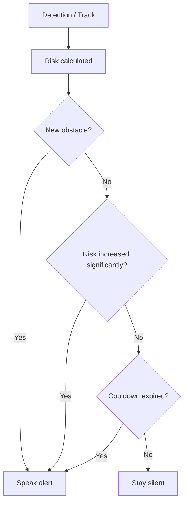

---

# 19. Spoken Guidance

Baseline Mobility phrases follow risk severity:

| Condition | Phrase |
|---|---|
| Corridor obstacle or forward echo <= 150 cm | “Obstacle ahead”; optionally name one associated visible class |
| Slow-down rule active | “Slow down. Obstacle ahead.” |
| STOP rule active | “STOP.” |
| Clearance confirmed under Section 17 | “No obstacle detected ahead.” |
| Evidence insufficient | “Cannot confirm the path is clear.” |

Automatic escape directions are disabled in the baseline because the selected sensors do not establish side clearance. If separately implemented and tested, directional correction remains below slow-down/STOP priority. During stationary Locate search, left/center/right describes the target's image position only.

---

# 20. Final Object Localization

After the user confirms arrival at the approximate target zone and stops walking, the phone shall switch to mandatory Android Locate YOLO for target-focused search. Direct nearby search is also available from Idle without laptop access.

Run one vision model at a time in the MVP. FinalSearch is a stationary/slow-scan mode, not walking assistance; announce “Stop walking. Searching for your keys.” Keep USB proximity STOP monitoring active when attached, but do not run Mobility corridor/vision-risk rules on Locate detections or claim that Locate replaces Mobility coverage. In search/Found, only the USB STOP rule and its hold/release behavior apply to proximity; do not announce path clearance or lower proximity tiers. A near table/target may itself trigger STOP, which takes speech priority over “found.” Returning to walking explicitly reloads Mobility, clears old tracks, and waits for fresh detections. A model switch or load failure cannot report a clear path.

Confirm a target only after confidence >= 0.60 in at least 3 of the latest 5 processed frames within 1 second, matched by same class and bounding-box IoU >= 0.30. Say “Keys detected” rather than asserting ownership. If multiple targets match, report multiple candidates. Give left/center/right image position using the box center (x < 1/3 left, x > 2/3 right, otherwise center), not metric distance. After 15 seconds without confirmation, say “Not found in this view”; allow continued search or cancel.

Search time starts after Locate is loaded and the mode is ready, not at button press; loading still has the separate 5-second limit. Only distinct fresh, usable frames count toward confirmation. Position uses the current accepted box in the upright unletterboxed camera frame, never the laptop's relative_x/relative_y. A timeout message occurs once per search attempt; Retry resets the attempt timer. A successful confirmation enters Found and stops repeating search announcements. Found remains a stationary session with camera health and USB STOP monitoring until the user acknowledges completion or presses Stop; never silently resume walking. Start navigation is an explicit new Mobility transition.

Example:

```text
Laptop memory:
keys → Team Table → right side

User reaches Team Table

Phone:
switch to target search
target = "keys"

Camera detects keys

TTS:
"Keys detected ahead and slightly right."
```

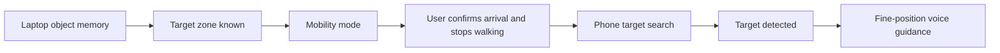

---

# 21. Voice Interaction

## 21.1 Core Intents

| Intent | Example |
|---|---|
| FIND_OBJECT | “Where are my keys?” |
| GUIDE_TO_OBJECT | “Guide me there.” |
| DESCRIBE_SCENE | “What is around me?” |
| READ_TEXT | “Read this.” |
| START_NAVIGATION | “Start navigation.” |
| SEARCH_NEARBY | “Search nearby for keys.” |
| CONFIRM_ARRIVAL | “I am at the table.” |
| STOP | “Stop.” |

For the hackathon, deterministic keyword/intent rules are acceptable.

A cloud LLM is not required for the core safety loop.

Accessible buttons for Start, Stop, target selection, path status, Search nearby, and arrival confirmation are mandatory. Voice input remains a Should feature; when enabled, these intents use the same handlers. User Stop cancels guidance and queued speech; a spoken risk-engine STOP warns of an obstacle and keeps monitoring active until the user cancels.

If voice input is enabled, do not treat the app's own TTS as a user command. The explicit Stop control remains available during speech and model loading; voice recognition cannot be the sole cancellation mechanism. Test recognized Stop through the same cancellation handler, while reporting recognition latency separately from handler latency.

---

# 22. OCR and Scene Understanding

Optional features:

### OCR

```text
Phone camera
   ↓
Frame crop
   ↓
OCR
   ↓
TTS
```

Example:

> “Room 204 — Computer Networks Lab.”

### Scene Summary

Instead of listing every YOLO detection:

> “There are two people ahead, a table on the left, and chairs along the right side.”

Scene descriptions must be lower priority than mobility alerts.

OCR and scene modes are optional stationary interactions. Do not unload Mobility or block its inference to satisfy these requests while walking. In the baseline, ask the user to stop/cancel Mobility before entering them; a scene summary derived from existing Mobility detections is permitted only if it does not affect AC-05/AC-06. No cloud result may issue a movement or clearance command.

---

# 23. Data Model

Section 11.1 is the authoritative SQLite schema. Areas, non-overlapping zones, enabled cameras, and camera profile versions live in a small local configuration file; separate relational tables are not required for the MVP.

A saved observation belongs to one scan, one camera profile, one class, and one zone. instance_in_scan separates simultaneous same-class detections but does not identify a physical object across scans. The API transfers observations; Android keeps only the selected target and short-lived perception state.

---

# 24. Functional Requirements

| ID | Requirement |
|---|---|
| FR-01 | Laptop webcam shall capture stationary video. |
| FR-02 | Locate YOLO shall detect configured personal objects. |
| FR-03 | Stationary detections shall be mapped to configured zones. |
| FR-04 | Valid observations shall be persisted in SQLite. |
| FR-05 | The system shall answer object-location queries using most recent trusted observations. |
| FR-06 | Android app shall capture real-time camera frames. |
| FR-07 | Mobility YOLO shall run on the phone. |
| FR-08 | ESP32-S3 shall read HC-SR04 distance. |
| FR-09 | ESP32-S3 shall stream distance readings to Android through USB. |
| FR-10 | Android app shall parse distance readings. |
| FR-11 | Android app shall determine obstacle overlap with the walking corridor. |
| FR-12 | Android app shall maintain short-lived object tracks. |
| FR-13 | Android app shall fuse vision and ultrasonic signals. |
| FR-14 | Risk engine shall classify obstacle urgency. |
| FR-15 | Alert engine shall produce concise spoken guidance. |
| FR-16 | Critical risk shall generate a STOP alert. |
| FR-17 | Duplicate alerts shall be throttled. |
| FR-18 | User shall be able to stop navigation immediately. |
| FR-19 | App shall detect invalid/missing ultrasonic readings. |
| FR-20 | Mobile app shall continue vision-only operation if ultrasonic data is unavailable. |
| FR-21 | Phone shall run Locate YOLO locally for final search and direct nearby search. |
| FR-22 | Optional OCR shall read text from the camera. |
| FR-23 | Optional scene summary shall describe nearby surroundings. |
| FR-24 | Standalone Mobility shall start and operate without laptop, internet, memory, or destination. |
| FR-25 | Fresh ultrasonic obstacles shall trigger generic warnings regardless of YOLO class or detection presence. |
| FR-26 | Path state shall be BLOCKED, CLEAR_OBSERVED, or UNKNOWN under Section 17. |
| FR-27 | App shall provide accessible controls for all mandatory flows and explicitly confirmed arrival. |
| FR-28 | Laptop and Android shall implement the versioned memory and sensor contracts below. |
| FR-29 | Object history shall be clearable locally; stale, ambiguous, and unavailable results shall be distinguished. |
| FR-30 | Session Stop/pause shall invalidate late callbacks and prevent automatic restart or speech from cancelled work. |
| FR-31 | Independent health deadlines, frame validity, and model readiness shall gate path state and assistance. |
| FR-32 | All mandatory flows shall be operable through accessible controls without speech recognition. |

---

# 25. Non-Functional Requirements

## 25.1 Latency

The mobile navigation loop must meet AC-05 and AC-06 on the selected phone. Use latest-frame processing with at most one pending frame; drop superseded frames instead of accumulating latency.

The team should optimize:

```text
camera capture
→ inference
→ tracking
→ sensor fusion
→ alert decision
```

rather than maximizing model size.

---

## 25.2 Offline Capability

Core mobile obstacle detection and nearby Locate search must work without internet.

Internet may be used for optional services, but not for:

- YOLO inference,
- ultrasonic reading,
- risk computation,
- STOP decision,
- Android TTS using an installed offline voice, required on the demo phone.

---

## 25.3 Reliability

- Invalid HC-SR04 data must not crash the app.
- USB disconnection must be detected.
- Camera failure must produce a visible/audible error.
- Model load errors must be shown clearly.
- Sensor fusion must degrade safely.

---

## 25.4 Privacy

Prefer local processing.

For the MVP:

- do not store continuous raw video,
- store structured object observations,
- allow object history to be cleared,
- avoid cloud upload by default.

---

# 26. Failure Handling

| Failure | Response |
|---|---|
| HC-SR04 returns no echo | Mark reading invalid |
| ESP32 disconnected | Continue vision-only with warning |
| YOLO confidence low | Do not attach object label |
| Ultrasonic obstacle but no YOLO match | Say “Obstacle ahead” |
| Multiple central objects | Avoid claiming exact distance-to-object association |
| Camera unavailable | Stop navigation assistance and notify user |
| Target object memory stale | Always use “last seen”; include age and require confirmation for a stale target |
| TTS unavailable | Refuse to start or pause active assistance; show a persistent accessible error. Optional haptics are supplementary, not a substitute for the mandatory spoken demo. |
| Laptop/API unavailable | Report memory unavailable; standalone walking and nearby search remain usable |
| Sensor invalid/stale | Discard distance for fusion, enter vision-only mode, never infer clear from missing distance |
| Locate model unavailable | Report search unavailable; never substitute Mobility detections for unsupported personal-object classes |
| Screen lock/background or lost audio route | Pause, invalidate pending output, require explicit restart; do not claim background operation |
| Camera delivers dark/covered/unusable frames | Reset clearance; continue only until the camera health deadline, then pause |
| Late HTTP/inference/TTS callback after Stop | Discard under the old session generation |
| SQLite write/clear failure | Roll back, report failure, retain previous committed history |
| Scan completes after Clear history/profile change | Reject commit; do not recreate cleared/stale-profile observations |

---

# 27. Safety Constraints

NaviSense is a hackathon prototype and must **not** be presented as a replacement for:

- a white cane,
- a guide dog,
- orientation and mobility training,
- certified assistive navigation equipment.

The phone camera and a single forward-facing ultrasonic sensor have blind spots.

Examples include:

- drop-offs,
- stairs descending,
- thin objects,
- glass,
- low/high obstacles outside sensor alignment,
- fast-moving objects,
- side collisions.

The demo should therefore be supervised.

The qualified envelope must be recorded before testing: flat indoor floor, no stairs/drop-offs, walking pace <= 0.5 m/s, fixed mount and corridor, selected lighting/range, and the actual objects/scenes tested. Repositioning the mount or changing the camera geometry requires rechecking alignment and affected gates. A single forward distance beam plus class-based vision is not a full-width traversability measurement; CLEAR_OBSERVED must retain the wording and limits in Section 6.2. Failed acceptance means the affected experience is unqualified, even if another experience works.

---

# 28. Hackathon Demo Setup

## 28.1 Suggested Physical Layout

```text
+-------------------------------------------------------+
|                                                       |
| Other Team Table          Chairs                     |
|                                                       |
|                Main Walking Aisle                    |
|                                                       |
|  Team SHELBY Table                                   |
|  +------------------+                                |
|  | laptop webcam    |                                |
|  | keys / wallet    |                                |
|  +------------------+                                |
|                                                       |
|                     Presentation Area                 |
+-------------------------------------------------------+
```

---

## 28.2 Demo Sequence

### Demo 0 — Standalone Walking

Turn off the laptop connection and internet. Start Mobility without selecting a target. Demonstrate an observed clear corridor, a recognized obstacle, and a broad opaque obstacle absent from the model's label map. The latter must still trigger a generic ultrasonic warning. Demonstrate near/critical escalation, sensor disconnection with UNKNOWN or a vision-based hazard, reconnection, and user Stop. Use a supervised slow walkthrough; use stationary bench tests for critical distances.

### Demo 1 — Hard Scan

Place keys/wallet on the team table.

Laptop:

```text
Locate YOLO
→ detects keys
→ maps to team_table_right
→ stores observation
```

### Demo 2 — Memory Query

User:

> “Where are my keys?”

NaviSense:

> “Your keys were last seen on the right side of the Team SHELBY table.”

### Demo 3 — Guided Mobility

User:

> “Guide me there.”

Phone announces the last-seen target zone and enters Mobility mode toward a user/supervisor-known destination; it does not compute a route.

Possible output:

> “Chair ahead.”

> “Obstacle ahead.”

> “Slow down.”

> “STOP.”

### Demo 4 — Final Search

After the user confirms arrival at the target zone and stops walking:

> “Searching for your keys.”

Phone switches to target search.

> “Keys detected ahead and slightly right.”

---

# 29. Measurable MVP Acceptance

These are required targets to validate, not achieved results. Record the exact phone/Android version, model hashes/runtime/input sizes, camera mount, firmware, configured thresholds, scene set, and results. All baseline acceptance gates below must pass on the assembled demo setup; report failures rather than silently relaxing targets. Start tests with fixed thresholds and held-out inputs. Keep original failed runs and every retest result; do not discard difficult scenes after seeing outcomes. Automated fixture results, physical-device measurements, and supervised walkthroughs are separate evidence categories.

| ID | Gate and measurement | Pass target |
|---|---|---|
| AC-01 | Standalone Mobility with laptop disconnected, internet off, no target; offline TTS and sensor attached | 10-minute run without crash; known and unlabeled obstacles produce warnings; no API dependency |
| AC-02 | Locate detection on held-out laptop and phone images, evaluated separately; >= 50 labeled instances per selected demo class per device and >= 20 negative frames per device; match at IoU >= 0.50 and confidence >= 0.60 | Per-class precision >= 90% and recall >= 85% on each device; report false positives and misses |
| AC-03 | 20 independent Hard Scans spanning selected objects, configured zones, clutter, and empty scenes | >= 18/20 scans correctly save expected class/zone/count with no extra instances; scan completes <= 5 seconds in >= 19/20; invalid/incomplete scans write nothing |
| AC-04 | Memory/API fixtures: age 60/61 seconds, missing/unsupported, duplicates, later empty scan, invalid profile, future timestamp/clock jump, clear during scan, profile change during scan, disk failure, unauthorized request, malformed/oversized response, mismatched class/age, timeout, and late responses | All cases follow Sections 11/13; scan/clear rollback correct; no repopulation after clear, stale/ambiguous auto-selection, or target restored after cancellation |
| AC-05 | Mobility runtime during the 10-minute run | >= 10 processed FPS averaged over each 60-second window; capture-to-risk-decision p95 <= 300 ms across >= 100 samples; no accumulating frame queue |
| AC-06 | 20 bench presentations: 10 at reference 30 cm and 10 at 40 cm, including no YOLO match; record physical entry into sensor coverage, all packets, decision, and audible onset | 20/20 produce STOP; decision <= 100 ms after first accepted close packet, audible onset <= 500 ms after that packet, and physical entry-to-audible onset <= 750 ms in every trial. No echo/missing packets or no STOP count as failures, not excluded samples |
| AC-07 | 20 supervised obstacle encounters starting at reference distance >= 200 cm, pace <= 0.5 m/s: 5 chair, 5 person, 5 bag/table, 5 broad opaque obstacles without a recognized YOLO class; all intersect mounted coverage | >= 19/20 audible warnings before reference distance falls below 100 cm; 5/5 unlabeled cases meet that deadline; stop trials before collision and retain misses |
| AC-08 | Sensor bench check, 20 readings at each of 30, 50, 75, 100, 150, 200 cm against a broad perpendicular target and tape reference | >= 90% valid readings at each distance; median absolute error <= 5 cm at each distance; report spread |
| AC-09 | Stable USB transport for 10 minutes, followed separately by 5 detach/reattach cycles | Stable run: >= 9 structurally accepted advancing records/second including VALID=0, sequence gap loss < 1%, no unplanned stream resets. Detach reflected <= 500 ms from detach; staleness <= 500 ms from last accepted valid receipt. Audible sensor-loss notice <= 1 second after detected loss when no urgent hazard is active, otherwise included in the next urgent warning within <= 5.5 seconds. Recovery <= 2 seconds after valid streaming resumes with permission granted |
| AC-10 | Deterministic replay of every Section 14/17 rule: distance boundaries, release equality/holds, loss during STOP, repeated invalid packets, backlog, wrap/reset, partial/oversize/malformed lines, recovery-close reading, multi-object/track churn, duplicate/late frames, geometry change, vision growth, and tentative corridor detections | All expected severities and states match the contract; no timer reset can indefinitely prolong loss hold; stale/invalid inputs cannot create clearance; no crash |
| AC-11 | Speech priority: repeated obstacle for 30 seconds, escalation while information is speaking, then user Stop; repeat cancellation 10 times | Unchanged awareness/slow-down <= 1 utterance per 5 seconds; persistent STOP <= 1 per 2 seconds; escalation bypasses cooldown and interrupts lower speech; user Stop ends queued/active guidance <= 250 ms after input handler, 10/10 |
| AC-12 | Clear and degraded-state checks: 5-minute unobstructed textured scene with valid far echo; then no echo, sensor removal, camera error/stall, covered/dark imagery, and TTS error/no-start | <= 1 false hazard warning/minute; no repeated clear chatter; no clear on invalid or unusable evidence; reported camera errors pause immediately, stall/quality timeout within 1 second plus <= 50 ms watchdog scheduling allowance; TTS failure blocks/pauses assistance with error |
| AC-13 | 10 searches per selected demo class, target visible within recorded range; half launched directly without laptop; 10 target-absent trials per class; measure from ready search | >= 9/10 confirmed within 5 seconds per class; correct left/center/right in >= 9/10; zero false found in absent trials; one timeout notice at 15 seconds within <= 500 ms when no higher-priority speech is active; model load <= 5 seconds measured separately |
| AC-14 | 5 full memory flows plus 5 model-switch/Stop cycles, including near-target USB STOP and switching failure | Correct refresh/selection, explicit arrival, local Locate inference, found-vs-STOP speech priority, fresh Mobility state on return, and cancellation all pass; no automatic walking restart |
| AC-15 | Lifecycle/cancellation: Stop during load, inference, lookup, speech, and scan-related target response; inject late callbacks; repeat lock/background, audio loss, permission revocation, and process restart | Every case rejects old-session output/target mutation, pauses or cancels as specified, and requires explicit restart; no automatic resumed guidance; handler-to-silence <= 250 ms for Stop |
| AC-16 | Operator completes standalone walking, nearby search, memory query/selection, stale/ambiguous selection, arrival, retry, and Stop using TalkBack with speech recognition disabled | All flows complete without interpreting the preview or color; Stop reachable during load/speech/errors; model/USB/configuration smoke checks recorded on the actual setup |

For latency, record capture, packet receipt, risk decision, and speech request using Android's monotonic clock; verify physical event time and audible onset with a common external recording correlated to test markers. Speech request time is not audible onset. Compute p95 by nearest-rank over the recorded samples. Preserve aggregate measurements and test results; routine operation still stores no continuous raw video.

Calculate sequence gap loss per uninterrupted connection as sum(missing sequence numbers) / (accepted advancing records + missing sequence numbers); exclude deliberate disconnect intervals, never unexplained resets. VALID=0 affects sensor-valid percentage, not transport delivery count. Precision/recall use one-to-one matches: unmatched predictions are false positives and unmatched labeled instances are misses. A positive-target/obstacle trial with no prediction or successful warning is a failure, not an omitted denominator; no prediction on a target-absent scene is correctly negative.

“Any object” means obstacle alerts are not conditional on recognizing its name. AC-07 demonstrates selected unlabeled obstacles within sensor coverage; it is not a universal obstacle-recall claim.

### Requirement-to-Evidence Coverage

| Requirements | Acceptance evidence |
|---|---|
| FR-01–FR-04: scan, detection, zones, storage | AC-02, AC-03, AC-04 |
| FR-05, FR-28–FR-29: query, contracts, history | AC-04, AC-09, AC-10, AC-14 |
| FR-06–FR-07, FR-11–FR-14: phone perception and risk | AC-05, AC-07, AC-10, AC-12 |
| FR-08–FR-10, FR-19–FR-20, FR-25: distance and degradation | AC-06, AC-08, AC-09, AC-10, AC-12 |
| FR-15–FR-18, FR-30: speech, STOP, cancellation | AC-06, AC-11, AC-14, AC-15 |
| FR-21: mandatory local Locate | AC-02, AC-13, AC-14 |
| FR-24, FR-26–FR-27, FR-31–FR-32: standalone, state, readiness, accessibility | AC-01, AC-10, AC-12, AC-15, AC-16 |
| FR-22–FR-23: optional OCR/scene | Excluded unless implemented; then verify stationary-mode limits, speech priority, and no regression of baseline gates |

Before calling the MVP accepted, record a result for every applicable gate, attach its evidence location, and obtain explicit project-owner review. Passing documentation/schema checks alone does not establish model performance, hardware function, usability, or safety.

---

# 30. Testing Plan

## 30.1 Locate Model Tests

Test objects under:

- different positions,
- different lighting,
- partial occlusion,
- clutter,
- distance changes,
- different orientations.

Record:

- precision,
- recall,
- confidence,
- false positives.

---

## 30.2 Mobility Model Tests

Test:

- stationary chair,
- table edge,
- walking person,
- backpack on floor,
- multiple chairs,
- crowded background,
- camera motion,
- dim lighting.

---

## 30.3 Ultrasonic Tests

Measure readings at approximately:

- 30 cm
- 50 cm
- 75 cm
- 100 cm
- 150 cm
- 200 cm

Do not assume calibration accuracy until measured with the actual assembled hardware.

---

## 30.4 Fusion Tests

| Scenario | Expected Result |
|---|---|
| Chair center + close ultrasonic distance | Proximity action from Section 17; optional chair label only if association qualifies |
| Chair left, no corridor overlap, fresh far distance | No vision hazard; clearance only after required hold |
| Ultrasonic obstacle + no YOLO match | Generic obstacle warning |
| YOLO object + invalid ultrasonic reading | Vision-only risk estimate |
| Object leaving path | Risk decreases only after release hold and remaining evidence checks |
| Same qualifying near track grows >= 25% in 0.5 seconds | Visual STOP |
| Persistent same object | Alert throttling works |

Also execute every gate in Section 29, especially unknown-class obstacles, clear/unknown transitions, risk boundaries, sensor backlog/recovery, memory ambiguity, cancellation during speech, and model switching. These tests validate the selected supervised demo envelope, not arbitrary indoor environments.

---

# 31. Evaluation Metrics

## 31.1 Locate Model

- per-class precision,
- per-class recall,
- mAP,
- missed small-object rate.

## 31.2 Mobile System

- inference FPS,
- end-to-end alert latency,
- obstacle recall,
- false warning frequency,
- USB packet loss,
- HC-SR04 valid-reading percentage.

## 31.3 User Experience

- number of unnecessary repeated alerts,
- percentage of commands understood correctly,
- average time to find target object,
- successful final-target localization.

---

# 32. Development Phases

## Team Ownership and Coordination

The user has assigned the following implementation ownership. This changes work allocation only; PRD v3.2 product requirements, contracts, thresholds, and acceptance gates remain unchanged. Assigned work is planned, not evidence of implementation or acceptance.

| Member | Primary ownership | Individual guidance |
|---|---|---|
| Spandan | Models, datasets, training, exports and model evaluation | [Spandan](spandan/guidance.md) |
| Subham | Laptop Locate/Hard Scan, object memory, REST API and Android memory client | [Subham](subham/guidance.md) |
| Rohan | Hardware, firmware, mounting, USB transport and Android sensor adapter | [Rohan](rohan/guidance.md) |
| Samik | Android camera, local inference for both models, visual tracking and nearby/final search engine | [Samik](samik/guidance.md) |
| Rishav | Risk logic, voice UX, accessible app shell, lifecycle and system integration | [Rishav](rishav/guidance.md) |

[Shared guidance](guidance.md) assigns phase tasks, source ownership, handoff producers/receivers, and all 16 acceptance leads/reviewers. Rishav coordinates shared Android build files and app/session integration; Samik owns perception rather than the risk/voice coordinator. Spandan supplies models to Subham and Samik; Subham, Samik and Rohan supply validated results/events to Rishav. Each member implements and tests their owned work; final project acceptance remains explicit.

Before Phase 1, complete a small smoke check of the actual phone/USB assembly, offline TTS, and both model exports. Record the chosen model/runtime/label maps and demo object set. This bounds compatibility risk early; it is not full acceptance or training completion.

## Phase 1 — Stationary Vision

Lead: Spandan for models/data; Subham for laptop webcam/runtime integration. Samik validates phone export compatibility.

- set up YOLO training,
- collect Locate dataset,
- fine-tune model,
- run detections from laptop webcam.

## Phase 2 — Hard Scan + Memory

Lead: Subham. Spandan supports detection quality; Rishav integrates query presentation.

- define zones,
- create persistence filtering,
- implement SQLite observations,
- implement object query.

## Phase 3 — ESP32-S3 Sensor Node

Lead: Rohan. Rishav reviews sensor event needs; Samik supports mount/camera alignment.

- wire HC-SR04,
- add voltage divider,
- test distance,
- stream values through USB serial.

## Phase 4 — Android Camera AI

Lead: Samik. Spandan supplies model artifacts; Rishav owns the app shell/lifecycle.

- create Android app,
- integrate camera,
- export/deploy Mobility YOLO,
- export/deploy mandatory Locate YOLO and validate phone viewpoints,
- display bounding boxes.

## Phase 5 — USB Integration

Lead: Rohan for Android USB and transport. Rishav integrates health/state handling.

- enumerate ESP32-S3,
- request USB permission,
- read serial stream,
- show distance.

## Phase 6 — Fusion + Risk

Lead: Rishav. Samik supplies visual evidence; Rohan supplies sensor evidence.

- define walking corridor,
- add tracking,
- correlate ultrasonic reading,
- implement deterministic proximity overrides and vision risk rules,
- implement alerts.

## Phase 7 — Voice UX

Lead: Rishav. All producers support cancellation and shared speech/lifecycle checks.

- Android TTS,
- stop command,
- alert throttling,
- priority speech, UNKNOWN/clear status, and immediate user cancellation.

## Phase 8 — Laptop ↔ Phone Integration

Lead: Rishav for app integration; Subham for API/client and full-flow evidence; Samik for search engine. Spandan supports model quality and Rohan verifies retained USB STOP.

- query target object,
- transfer zone/target info,
- switch phone from mobility to final search.
- use explicit arrival confirmation; verify standalone walking with the laptop disconnected.

## Phase 9 — Hackathon Calibration

Coordination: Rishav. Every member executes their assigned gates and reviews according to shared guidance.

- test hall lighting,
- test chair/table detection,
- test USB stability,
- tune risk thresholds,
- rehearse demo.

---

# 33. Recommended Software Stack

## Laptop

| Layer | Technology |
|---|---|
| Vision | Ultralytics YOLO |
| Camera | OpenCV |
| Training | Python + PyTorch / Ultralytics |
| Memory | SQLite |
| API | FastAPI, versioned local REST contract in Section 13.3 |
| Voice | optional local STT/TTS |
| Object query | Python |

## Android

| Layer | Technology |
|---|---|
| App | Kotlin |
| Camera | CameraX |
| Model | Mobility YOLO and mandatory Locate YOLO mobile exports |
| Inference | LiteRT/TFLite or NCNN |
| USB | Android USB Host APIs |
| Tracking | lightweight custom tracker / library |
| TTS | Android TextToSpeech |
| STT | Android SpeechRecognizer or local model |
| Networking | One HTTP client for local REST; no WebSocket required |

## ESP32-S3

| Layer | Technology |
|---|---|
| Firmware | Arduino framework or ESP-IDF |
| Sensor | HC-SR04 |
| Transport | USB CDC / serial |
| Logic | minimal distance acquisition |

---

# 34. Suggested Repository Structure

```text
navisense/
|
+-- laptop/
|   +-- app/
|   +-- vision/
|   +-- memory/
|   +-- api/
|   +-- config/
|   +-- tests/
|
+-- android/
|   +-- app/
|   +-- camera/
|   +-- inference/
|   +-- usb/
|   +-- navigation/
|   +-- voice/
|   +-- networking/
|
+-- esp32/
|   +-- navisense_sensor/
|
+-- models/
|   +-- locate/
|   +-- mobility/
|
+-- datasets/
|   +-- locate/
|   +-- mobility_finetune/
|
+-- docs/
|   +-- PRD.md
|   +-- architecture/
|
+-- scripts/
    +-- export_model.py
    +-- evaluate.py
```

---

# 35. MVP Priority Matrix

| Feature | Priority |
|---|---|
| Laptop Locate YOLO | Must |
| Hard Scan | Must |
| Object memory | Must |
| Object query | Must |
| Phone Mobility YOLO | Must |
| Phone Locate YOLO | Must |
| Standalone walking and path status | Must |
| Direct nearby-object search | Must |
| ESP32-S3 + HC-SR04 | Must |
| USB serial | Must |
| Sensor fusion | Must |
| Risk engine | Must |
| STOP warning | Must |
| Alert throttling | Must |
| Final object search | Must |
| Directional escape guidance with validated side clearance | Should |
| Voice input | Should |
| OCR | Should |
| Scene description | Should |
| Multi-room routing | Could |
| Full SLAM | Won't for MVP |
| Multiple ultrasonic sensors | Won't for MVP |
| Haptics | Future |
| Depth camera | Future |

---

# 36. Key Engineering Decisions

### Decision 1

Use **two specialized YOLO models**, not one generic model for everything.

### Decision 2

Keep the laptop stationary and optimize it for persistent spatial memory.

### Decision 3

Run mobile navigation fully on the phone, including standalone walking without a target or laptop. Run Locate YOLO on Android for nearby and final search.

### Decision 4

Use ESP32-S3 as a USB sensor bridge rather than as the AI computer.

### Decision 5

Use HC-SR04 as forward obstacle-distance confirmation, not as object identification.

### Decision 6

Associate ultrasonic readings only with objects plausibly inside the sensor/camera center corridor.

### Decision 7

Use deterministic navigation rules for safety-critical commands.

### Decision 8

Use pretrained mobility classes wherever possible and spend custom-training effort on personal objects.

### Decision 9

Treat the hackathon hall as named **zones**, not fake “rooms.”

### Decision 10

Use short spoken actions instead of narrating every detection.

---

# 37. Future Roadmap

## Product Version 2 (future; separate from PRD revision)

- multiple fixed cameras,
- automatic camera-to-room registration,
- richer object history,
- improved mobile tracking,
- phone depth API where available,
- haptic alerts.

## Product Version 3 (future; separate from PRD revision)

- ToF / depth sensor,
- multiple ultrasonic directions,
- visual-inertial odometry,
- improved indoor mapping,
- route confidence,
- caregiver configuration app.

## Long-Term

- SLAM,
- semantic indoor maps,
- multi-device camera network,
- wearable enclosure,
- stereo/depth vision,
- personalized navigation policies,
- accessibility-focused user studies,
- formal safety evaluation.

---

# 38. Risks and Mitigations

| Risk | Impact | Mitigation |
|---|---|---|
| Small-object model misses keys | FIND fails | Better dataset, closer camera, higher input resolution |
| Phone inference too slow | Late warnings | Smaller model, lower resolution, mobile runtime optimization |
| USB host incompatibility | Sensor unavailable | Test exact phone early; keep vision-only fallback |
| HC-SR04 unstable or delayed | Incorrect distance/late warning | Validity/freshness checks, measured physical-event latency, degraded UNKNOWN; never smooth away immediate close STOP |
| Sensor/camera misalignment | Wrong association | Fixed mount and calibration |
| Hall too crowded | Many detections | Walking corridor + risk filtering |
| Repeated TTS | User overload | Cooldown and track-based throttling |
| Lighting changes | Detection degradation | Augmentation + hall calibration |
| Laptop moved after calibration | Wrong zones | Recalibrate camera profile |
| Old object memory | Misleading answer | Timestamp-aware “last seen” wording |

---

# 39. Demo Narrative for Judges

> NaviSense uses two specialized visual systems instead of trying to solve everything with one model.  
> The stationary laptop acts like a persistent memory for the environment. It performs a hard scan, identifies personal objects, and remembers their last known zone.  
> When the user wants to move, a separate Android application takes over. The phone runs a real-time mobility YOLO model while an ESP32-S3 sends physical distance readings from an HC-SR04 sensor over USB-C.  
> The phone fuses both signals, decides whether an obstacle is actually in the walking path, and speaks only the action the user needs — such as “obstacle ahead,” “slow down,” or “stop.”  
> When the user reaches the target area, the phone switches into object-search mode and performs final local localization.

Standalone walking is a separate demonstration: the phone and USB sensor provide obstacle guidance with the laptop disconnected and no object-search task active. Arrival in the object-finding demonstration is explicitly confirmed by the user; the MVP does not claim automatic positioning or autonomous routing.

---

# 40. One-Line Product Definition

> **NaviSense AI is a two-layer assistive vision system that remembers where important objects were last seen and combines phone-based AI vision with ultrasonic sensing to provide real-time indoor obstacle guidance by voice.**

---

# 41. Final MVP Architecture

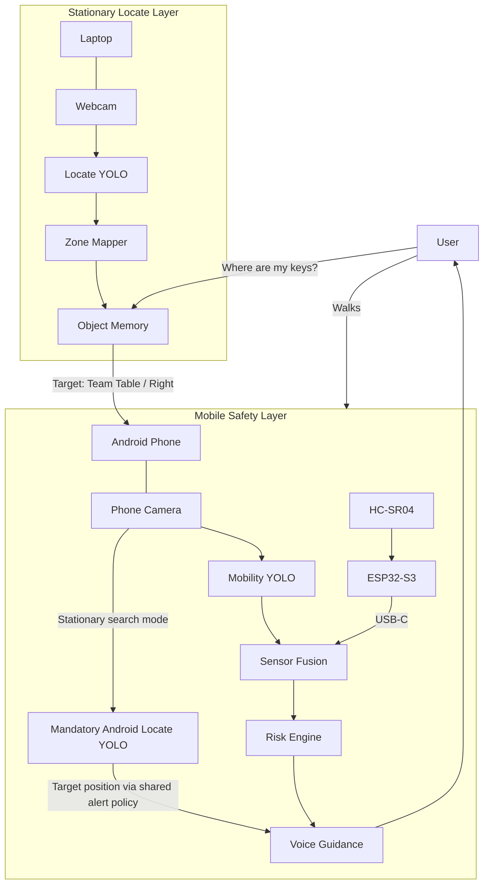

---

## Final MVP Principle

> **Laptop remembers. Phone independently assists walking and searches nearby. ESP32 measures. HC-SR04 reports forward distance even without an object label. YOLO identifies supported visible objects. The risk engine decides what matters. Voice tells the user only what to do next.**

## Communication branch — mandatory

Use the dedicated `communication` Git branch and its append-only `team-chat.md` for work chats, progress, blockers, handoff delivery/acknowledgement, review responses and decisions. Only chat/decision-log changes belong there; code, models, datasets, firmware and implementation/status documents stay on their work branches. Link evidence and source revisions in messages. Chat is not test evidence or authority to alter frozen files. Follow AGENTS.md for synchronization and conflict handling. Record actual times; never claim a handoff accepted without the receiver's response. The branch/log must be set up when Git is initialized; this documentation does not claim they already exist.
